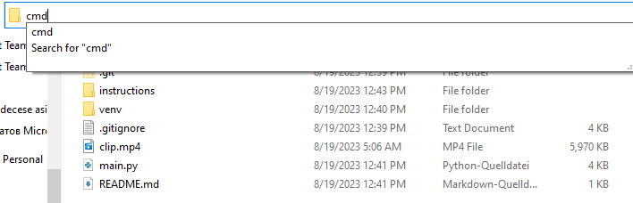
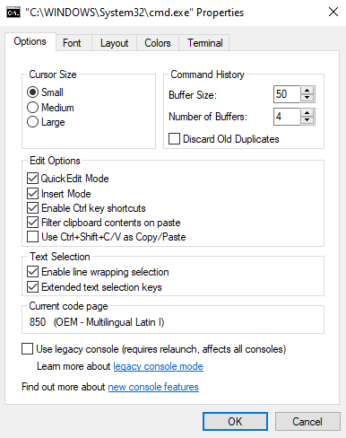
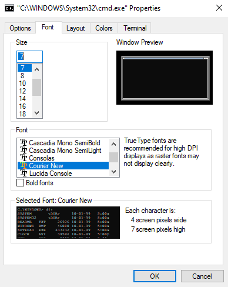
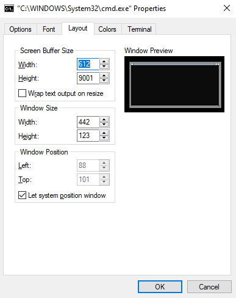
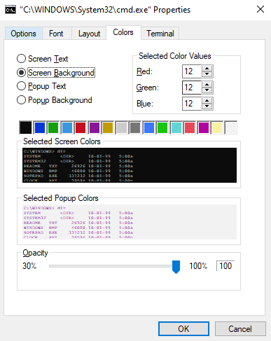
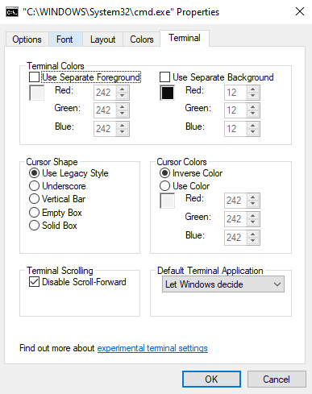

# Make your videos lower quality 

## Instalation

This is a breed instruction on how to make YOUR clips into ASCII art. 
First and foremost you will need to download the git repository from [here](https://github.com/DavidTorbics20/VideoDowngrader.git) or from the .zip file provided. 

## Running CMD

After downloading the reposiory or extracting all the files head to your file explorer and type in *CMD* as shown in the picture down below: 



Make sure to do this in the folder where you have the other files. 

## Adjusting CMD setting

Second of all you'll need to adjust the settings of your terminal. For this also just copy the settings provided below:







## Choosing and playing a clip

Finally, you'll need to copy your awesome clips into the current working folder. And after that you'll need to copy these lines of code and replacing the *YOURFILENAME* with the name of your file. Every line is important even the blank one at the end. 

``` text 
cls 
venv\\Scripts\\activate 
python main.py 
YOURFILENAME.mp4 

```

It is recomended to first copy this text into some placeholder, replacing the name of the file and only after that pasting it into the terminal.

After running it successfully one you'll only need these lines, with the blank line as well. 

``` text
python main.py
YOURFILENAME.mp4

```

Or you could execute existing animations by copying this.

``` text 
python main.py
YOURFILENAME.mp4-lowquality.txt

``` 

Enjoy the scaled down version of your clips.

## Editors tones

This has only been tried on Windows 10 so there's no guarantee that it will work on other operating systems. The instructions need to be followed step-for-step or else it might not work propperly or even at all. Only .mp4 files have been tested so there's no guarantee that other files formats will work as well. Crashes can also accour if the user has not installed python on their PC and to solve that python needs to be installed. The recomended clip length is not longer than 30 seconds due to poor optimisation of the code. 

